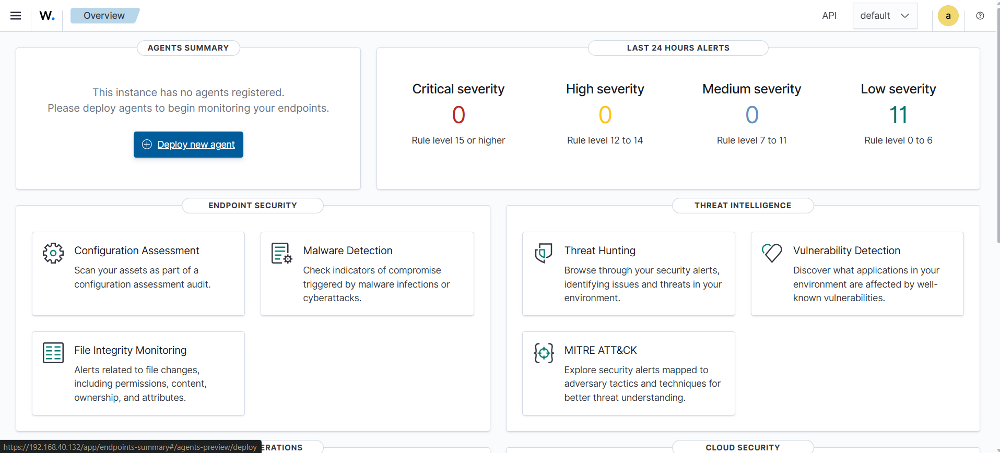
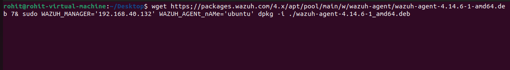
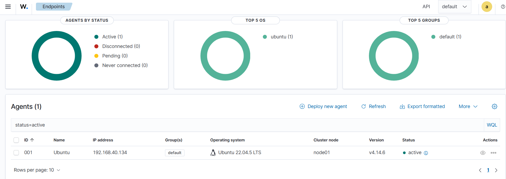
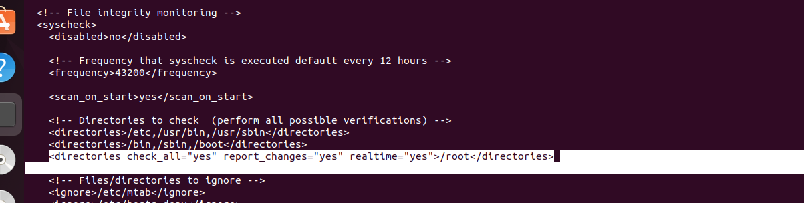
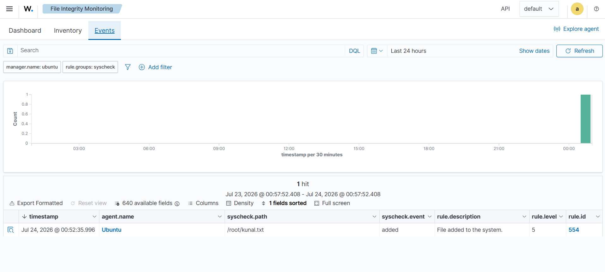
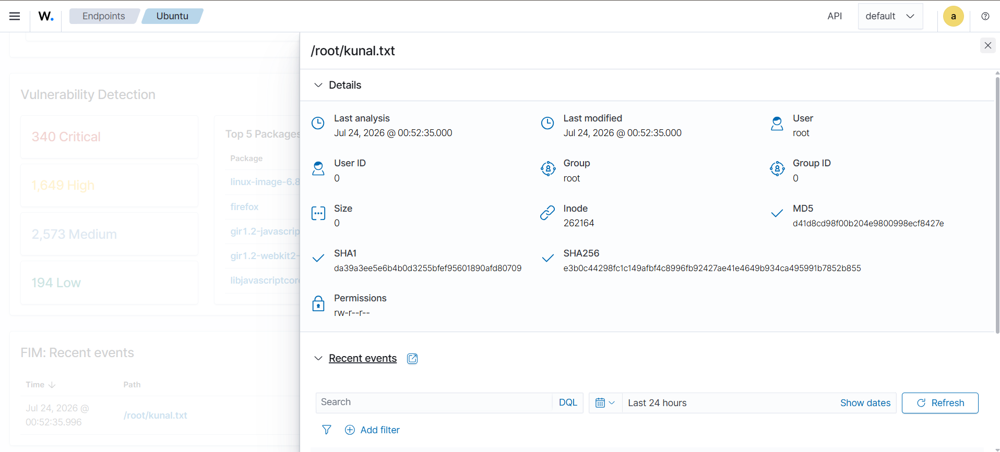

# Wazuh File Integrity Monitoring (FIM)

## 📌 Project Overview

This project demonstrates the implementation of **Wazuh File Integrity Monitoring (FIM)** to detect unauthorized or unexpected changes to files on an Ubuntu endpoint.

The project covers **Wazuh agent deployment, agent verification, FIM configuration, file-change simulation, and security event detection**.

---

## 🎯 Objectives

* Deploy and connect a **Wazuh Agent** with the Wazuh Manager.
* Configure **File Integrity Monitoring (FIM)**.
* Monitor selected directories for file changes.
* Simulate a file creation event.
* Detect and analyze the generated Wazuh security event.
* Verify file details and cryptographic hashes.

---

## 🛠️ Technologies & Tools

* **Wazuh**
* **Ubuntu 22.04 LTS**
* **Linux**
* **Wazuh Agent**
* **Wazuh Manager**
* **Syscheck / File Integrity Monitoring**
* **SHA-256 / SHA-1 / MD5**

---

## 🏗️ Project Architecture

```text
Ubuntu Endpoint
      │
      │ Wazuh Agent
      ▼
Wazuh Manager
      │
      ▼
File Integrity Monitoring
      │
      ▼
File Change Detected
      │
      ▼
Security Event / Alert
```

---

## ⚙️ Implementation Steps

### 1. Wazuh Overview Dashboard

The Wazuh dashboard was used to monitor agents, alerts, endpoint security, threat intelligence, and FIM capabilities.



---

### 2. Wazuh Agent Deployment

A new Ubuntu agent was configured from the Wazuh dashboard and assigned to the default group.


---

### 3. Agent Installation

The Wazuh Agent package was downloaded and installed on the Ubuntu endpoint using the provided installation command.



---

### 4. Agent Verification

The Ubuntu endpoint successfully connected to the Wazuh Manager and appeared with **Active** status.



---

### 5. FIM Configuration

File Integrity Monitoring was configured using the Wazuh `ossec.conf` configuration.

The configuration included:

* `scan_on_start`
* Directory monitoring
* `realtime="yes"`
* `report_changes="yes"`



---

### 6. File Change Detection

A test file named `kunal.txt` was created in the monitored `/root` directory.

Wazuh successfully detected the file creation through **Syscheck/FIM**.

The generated event showed:

* Agent: **Ubuntu**
* Path: `/root/kunal.txt`
* Event: **added**
* Rule: **554**
* Rule Level: **5**
* Description: **File added to the system**



---

### 7. File Details and Hash Verification

The detected file was inspected through Wazuh, showing its metadata, permissions, timestamps, and cryptographic hashes.



---

## 🔍 Result

The project successfully demonstrated that **Wazuh can monitor files on an Ubuntu endpoint and generate security events when changes occur**.

The complete workflow was successfully validated:

**Agent Deployment → Agent Connection → FIM Configuration → File Creation → Change Detection → Event Analysis**

---

## 💡 SOC Relevance

File Integrity Monitoring is useful for detecting:

* Unauthorized file modifications
* Suspicious file creation
* Changes to critical system directories
* Potential attacker activity
* Configuration tampering

This project demonstrates practical experience with **endpoint monitoring, SIEM-based security event analysis, and FIM**, which are relevant skills for a **SOC Analyst** role.

---

## 📚 Key Learning Outcomes

* Wazuh Agent and Manager architecture
* Linux endpoint monitoring
* FIM / Syscheck configuration
* Security event investigation
* File metadata and hash analysis
* Basic SOC monitoring workflow

---

## 👨‍💻 Author

**Rohit Bavaskar**

B.Tech Computer Engineering 

GitHub: **rohitbavaskar02**
